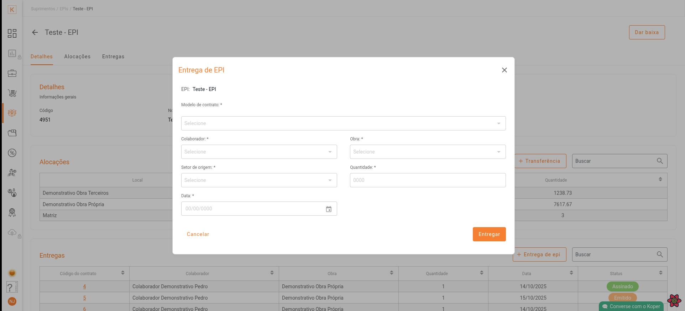

# 📹 Suporte a Vídeos no Agente Koper

## ✅ Implementação Completa

O sistema agora suporta **vídeos** além de imagens! Você pode incluir vídeos na documentação e o Agente Koper irá renderizá-los automaticamente nas respostas.

## 📁 Estrutura de Arquivos

```
docs-gestao-epi/
├── images/              # Pasta para imagens
│   ├── exemplo.png
│   └── ...
├── videos/              # Pasta para vídeos (NOVA!)
│   ├── tutorial-1.mp4
│   ├── demo-entrega.mp4
│   └── ...
├── images_map.json      # Mapeamento de imagens
├── videos_map.json      # Mapeamento de vídeos (NOVO!)
└── gestao_epi_documentacao.md
```

## 🎬 Como Adicionar Vídeos

### 1. Adicione o vídeo na pasta `videos/`

Coloque seu arquivo de vídeo (`.mp4`, `.webm`, `.ogg`, etc.) na pasta `docs-gestao-epi/videos/`

### 2. Registre o vídeo no `videos_map.json`

Adicione uma entrada no arquivo `videos_map.json`:

```json
{
    "tutorial-entrega-epi.mp4": "/caminho/absoluto/para/docs-gestao-epi/videos/tutorial-entrega-epi.mp4",
    "demo-cadastro.mp4": "/caminho/absoluto/para/docs-gestao-epi/videos/demo-cadastro.mp4"
}
```

### 3. Referencie o vídeo na documentação Markdown

Use a sintaxe padrão do Markdown para vídeos:

```markdown
## Como fazer uma entrega de EPI

Para fazer uma entrega de EPI, siga os passos abaixo:

1. Acesse o módulo de Gestão de EPI
2. Clique em "Nova Entrega"
3. Preencha os dados solicitados


O vídeo acima mostra o processo completo de entrega de EPI.
```

## 🎯 Como Funciona

1. **Processamento**: O sistema detecta automaticamente referências de vídeo no Markdown usando `` e converte para tags `[video: nome-do-arquivo.mp4]`

2. **Armazenamento**: As tags são armazenadas junto com o texto no vector store

3. **Busca RAG**: Quando o usuário faz uma pergunta, o sistema busca o contexto relevante (incluindo as tags de vídeo)

4. **Resposta**: O modelo LLM inclui as tags na resposta

5. **Renderização**: O frontend detecta `[video: ...]` e renderiza o vídeo usando `st.video()`

## 🎨 Formatos Suportados

O Streamlit suporta nativamente os seguintes formatos:

- ✅ `.mp4` (H.264 codec)
- ✅ `.webm` (VP8/VP9 codec)
- ✅ `.ogg` (Theora codec)
- ✅ URLs de YouTube, Vimeo, etc.

## 📝 Exemplo Completo

### Arquivo: `gestao_epi_documentacao.md`

```markdown
## 6. Entrega de EPI ao Colaborador



*Fluxo de entrega ao colaborador: seleção de modelo de contrato, colaborador, obra, quantidade e data prevista.*

### 🎬 Tutorial em Vídeo

Veja o tutorial completo em vídeo:


### 🔹 Passos:

1. Selecione o modelo de contrato
2. Escolha o colaborador e a obra
3. Defina setor de origem, quantidade e data prevista
4. Clique em Entregar
```

### Resultado no Chat:

Quando o usuário perguntar **"Como fazer uma entrega de EPI?"**, o sistema irá:

1. Mostrar o texto explicativo
2. Renderizar a **imagem** do modal
3. Renderizar o **vídeo** do tutorial
4. Ambos com controles de reprodução completos!

## 🔧 Dicas Importantes

1. **Tamanho dos vídeos**: Mantenha os vídeos com tamanho razoável (< 50MB) para melhor performance
2. **Compressão**: Use ferramentas como FFmpeg para comprimir vídeos sem perder qualidade
3. **Legendas**: Considere adicionar legendas aos vídeos para melhor acessibilidade
4. **Nomes descritivos**: Use nomes de arquivo claros e descritivos

## 🚀 Próximos Passos

Para adicionar seus próprios vídeos:

1. Coloque os arquivos `.mp4` na pasta `docs-gestao-epi/videos/`
2. Atualize o `videos_map.json` com os caminhos absolutos
3. Referencie os vídeos na documentação usando a sintaxe Markdown
4. Recarregue os documentos no Streamlit
5. Faça perguntas e veja os vídeos serem renderizados automaticamente! 🎉
