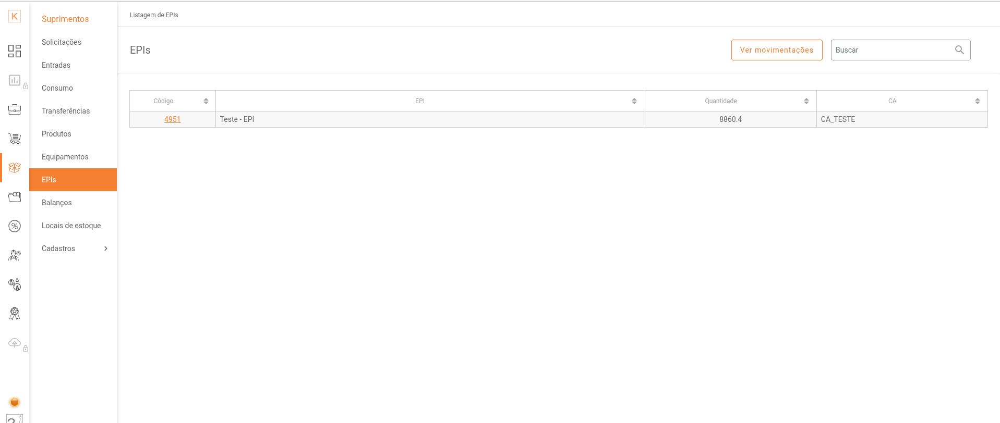
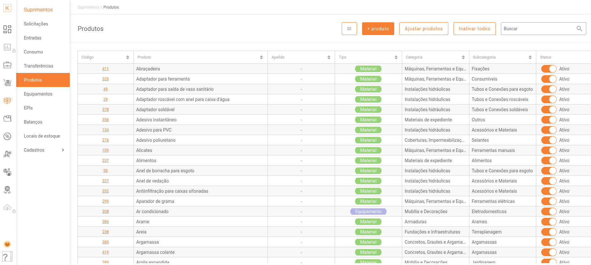
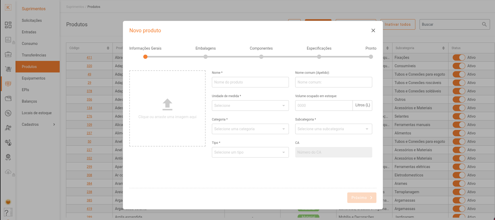
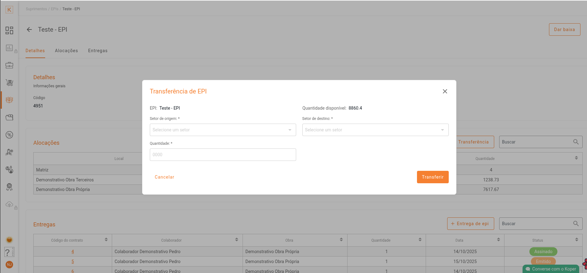
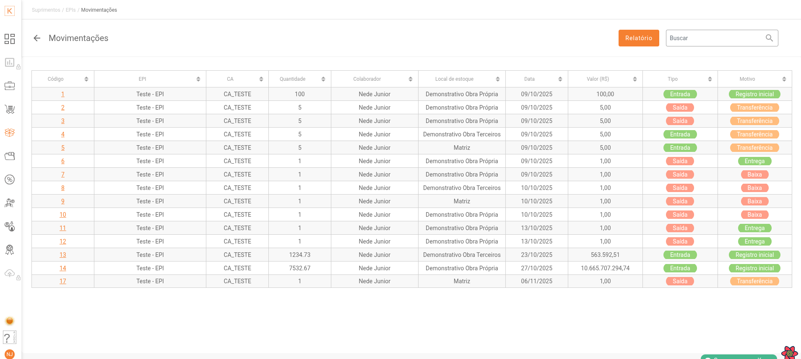
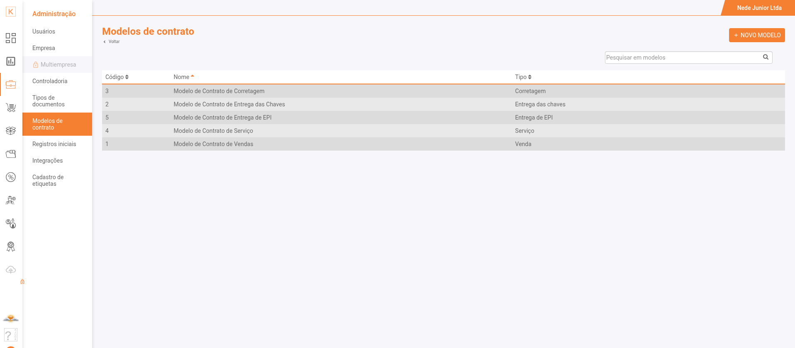
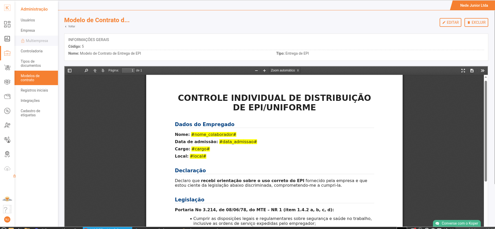
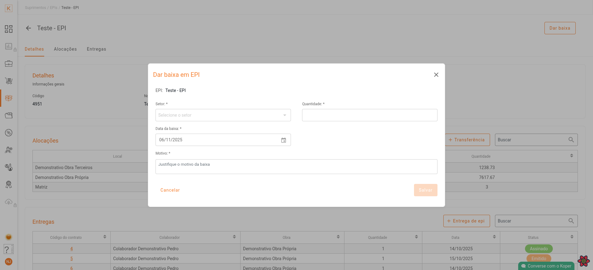
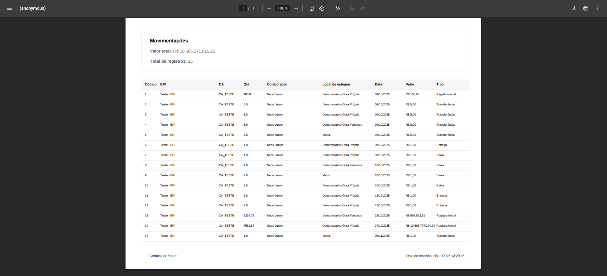

# 🪖 Documentação: Módulo de Gestão de EPI

Este documento descreve detalhadamente o fluxo de **gestão de Equipamentos de Proteção Individual (EPI)** dentro do sistema.  
Baseado no tutorial em vídeo e nas telas do **Figma**, o conteúdo cobre desde o **cadastro inicial** até o **gerenciamento completo de estoque, transferências, entregas, devoluções e baixas**.

*Vídeo de apresentação completa do módulo de Gestão de EPI, mostrando todas as funcionalidades do sistema.*

---

## 🏠 Dashboard Principal de Suprimentos

*Visão geral do módulo de Suprimentos: mostra KPIs, níveis de estoque por local e atalhos para operações (Entradas, Transferências, Contratos). Use esta tela para ter uma visão rápida do estado dos EPIs.*

---

## 1. Cadastro de um Novo EPI

Para que um EPI seja gerenciado, ele deve primeiro ser cadastrado no sistema como **produto**.

**Como acessar:**  
Módulos de **Suprimentos**, **Engenharia** ou **Compras** → Tela **Produtos**.

*Tela de listagem de produtos onde o usuário inicia o cadastro de um novo EPI. Observe os filtros, botão "+ Produto" e colunas principais (nome, categoria, tipo).* 

### 🔹 Passos:
1. Na tela **Produtos**, clique em **+ Produto**.  
2. Preencha os campos obrigatórios:
   - Nome do EPI  
   - Unidade de medida (ex: UN, Par, CX)  
   - Categoria  
   - Subcategoria  
3. No campo **Tipo**, selecione **EPI**.  
4. Um campo opcional **Número do Certificado de Aprovação (CA)** será exibido — preencha, se disponível.  
5. Clique em **Próximo**.  
6. Adicione informações adicionais, se necessário.  
7. Clique em **Salvar** para concluir.

*Modal/formulário de cadastro de produto do tipo EPI — campos obrigatórios e opcionais (incl. CA). Documente validações importantes: tamanho máximo, formatos aceitos e exemplos.*

*Vídeo tutorial mostrando passo a passo como cadastrar um novo EPI no sistema.*

### 🧾 Resultados após o cadastro:
- Estado vazio (primeiro acesso)  
- Listagem com EPIs cadastrados

---

## 2. Registro Inicial de Estoque (Entrada)

Após cadastrar o EPI, registre sua **quantidade inicial em estoque** (ex: Matriz).

**Como acessar:**  
Menu principal → **Entradas** → **+ Entrada**

### 🔹 Passos:
1. Pesquise e selecione o EPI cadastrado.  
2. Em **Tipo de entrada**, escolha **Registro inicial**.  
3. Selecione o **Local de destino** (ex: Matriz).  
4. Informe **Quantidade** e **Valor**.  
5. Clique em **Salvar**.

.mp4 "Tutorial - Registro Inicial no Estoque")

*Vídeo demonstrando o processo completo de dar entrada no estoque (registro inicial).*

✅ O EPI agora consta no estoque do local selecionado.

---

## 3. Transferência de EPI entre Locais

Permite mover EPIs entre locais (ex: **Matriz → Filial/Obra**).

### 3.1. Solicitar Transferência (Saída da Origem)

1. Acesse **Listagem de EPIs**.  
2. Clique no EPI desejado.  
3. Na aba **Alocações**, clique em **+ Transferência**.

*Modal para solicitar transferência de EPI entre locais: escolha origem, destino, quantidade e motivo. Gera transferência com status "Pendente" até confirmação.*

.mp4 "Tutorial - Transferência de EPI entre Locais")

*Vídeo demonstrando o processo completo de transferência de EPI entre locais (ex: Matriz para Filial).*

**Preencha:**
- Setor de origem  
- Destino  
- Quantidade  

🕐 Clique em **Transferir** para gerar uma solicitação (status: **Pendente**).

### 3.2. Confirmar Transferência (Saída da Origem)
1. Vá até **Transferências** no menu.  
2. Selecione a transferência pendente.  
3. Informe a quantidade e clique em **Salvar**.

📦 O EPI sai do estoque de origem e fica “**em trânsito**”.

### 3.3. Confirmar Entrada (Recebimento no Destino)
1. No destino, acesse **Entradas Pendentes**.  
2. Localize a transferência.  
3. Confirme a entrada e clique em **Salvar**.

📍 O estoque do EPI é atualizado no local de destino.

---

## 4. Visualizar Movimentações de EPI

**Como acessar:**  
1. Vá até a **Listagem de EPIs**.  
2. Clique em **Ver movimentações**.

*Relatório detalhado de movimentações (entradas, saídas, transferências, baixas). Útil para auditoria e geração de relatórios em PDF.*

*Vídeo mostrando como visualizar as movimentações de um EPI no sistema.*

---

## 5. Gestão de Contratos de Entrega de EPI

Antes da entrega ao colaborador, configure o **modelo de contrato**.

*Listagem dos modelos de contrato de entrega: crie, edite ou defina um modelo padrão com marcadores automáticos para preenchimento do contrato.*

### Funcionalidades:
- Modelo padrão com marcadores automáticos  
- Criação e edição de novos modelos  

*Editor do modelo de contrato: variáveis (nome do colaborador, EPI, data) e visualização do layout final. Importante para garantir consistência legal.*

*Vídeo tutorial sobre como configurar o modelo de contrato de entrega de EPI.*

---

## 6. Entrega de EPI ao Colaborador

*Fluxo de entrega ao colaborador: seleção de modelo de contrato, colaborador, obra, quantidade e data prevista. Gera contrato com status "Emitido".*

### 🔹 Passos:
1. Selecione o **modelo de contrato**.  
2. Escolha o **colaborador** e a **obra**.  
3. Defina **setor de origem**, **quantidade** e **data prevista**.  
4. Clique em **Entregar**.

*Vídeo demonstrando o processo completo de entrega de EPI ao colaborador.*

📄 O contrato é gerado e o status muda para **Emitido**.

---

## 7. Gerenciamento da Entrega

### 7.1. Anexar Contrato Assinado
Envie o arquivo assinado e clique em **Salvar**.

### 7.2. Editar Informações (Antes da Assinatura)
Permite alterar colaborador, obra ou quantidade enquanto o status for **Emitido**.

### 7.3. Efetuar a Entrega (Assinar Contrato)
Clique em **Assinar contrato** para confirmar.

### 7.4. Devolução de EPI
Clique em **Devolver EPI** para registrar devoluções.

*Vídeo mostrando como registrar a devolução de um EPI no sistema.*

### 7.5. Cancelar Entrega
Clique em **Excluir contrato** antes da assinatura.

*Vídeo explicando como cancelar uma entrega de EPI.*

---

## 8. Dar Baixa em EPI (Dano, Vencimento, Descarte)

*Modal para registrar baixa por dano, vencimento ou descarte. Registre setor, quantidade, data e motivo — ação irreversível no estoque.*

### 🔹 Passos:
1. Informe **setor**, **quantidade**, **data** e **motivo** (Dano, Vencimento ou Descarte).  
2. Clique em **Salvar**.

_.mp4 "Tutorial - Baixa de EPI")

*Vídeo demonstrando o processo de dar baixa em um EPI por dano ou vencimento.*

🗑️ O EPI é removido **permanentemente** do estoque.

### 📘 Detalhamento do Processo de Baixa
A baixa é essencial para controlar corretamente a **vida útil e segurança dos equipamentos**.  
Ela garante que itens danificados, vencidos ou descartados não sejam reutilizados.

---

## 9. Relatório de Movimentações de EPI

*Exemplo de PDF consolidado gerado pela funcionalidade de Relatório: inclui filtros aplicados, período e resumo por local e categoria.*

### 🔹 Como acessar:
1. Vá até a página **Movimentações**.  
2. Clique em **Relatório** → gera um **PDF consolidado**.

*Vídeo mostrando como gerar relatórios de movimentações de EPI.*

---

## 🧭 Resumo de Acesso e Status

| Ação | Módulo | Status/Resultado |
|------|---------|------------------|
| Cadastro de EPI | Suprimentos / Engenharia / Compras | Produto criado com tipo EPI |
| Registro de Estoque | Entradas | EPI disponível no local |
| Transferência | Alocações / Transferências | Pendente → Em trânsito → Concluída |
| Entrega | Contratos | Emitido → Assinado |
| Baixa | Movimentações | Removido permanentemente |
| Relatório | Movimentações | PDF consolidado |

---

## 🧩 Conclusão

O módulo de Gestão de EPI garante **rastreabilidade completa**, desde o cadastro até o descarte, promovendo **segurança operacional e controle eficiente de estoque**.  
Este documento serve como **base de conhecimento** para uso em modelos de **RAG (Retrieval-Augmented Generation)**, facilitando a extração semântica e automação de respostas sobre o processo de EPI no sistema.
